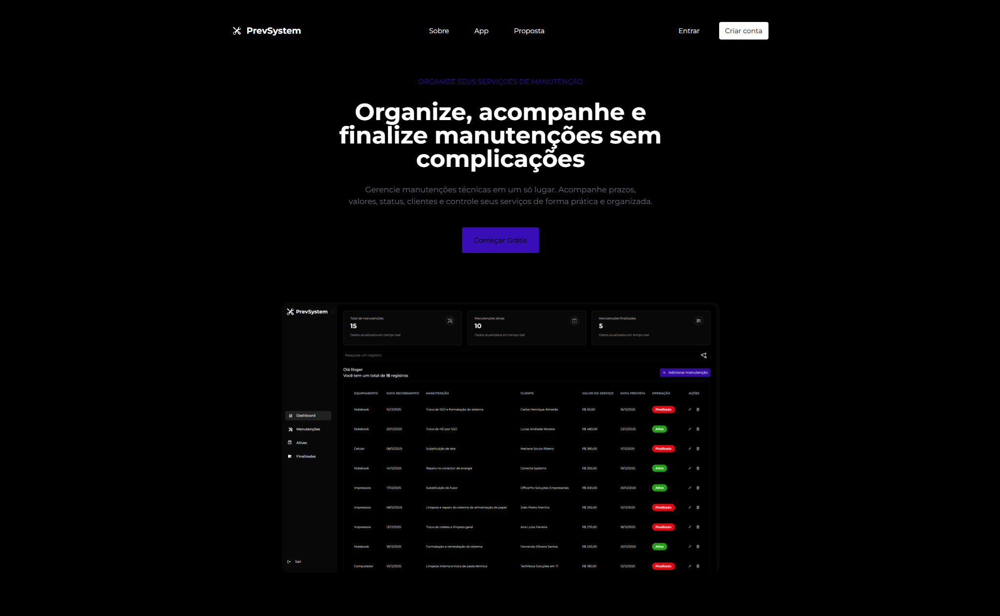
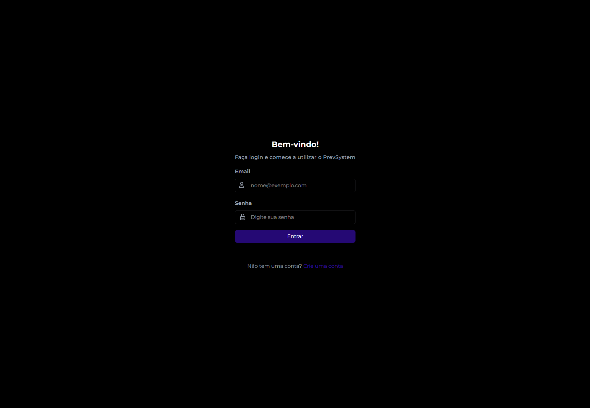
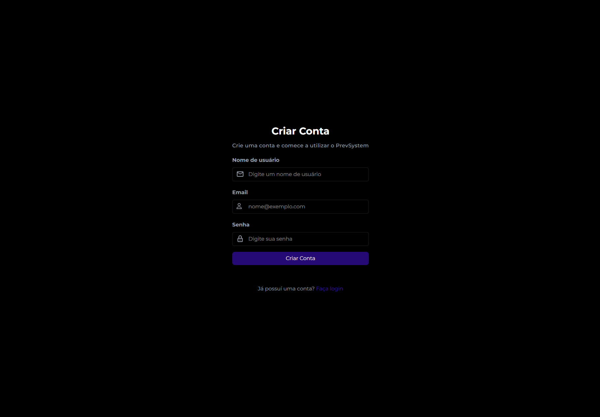
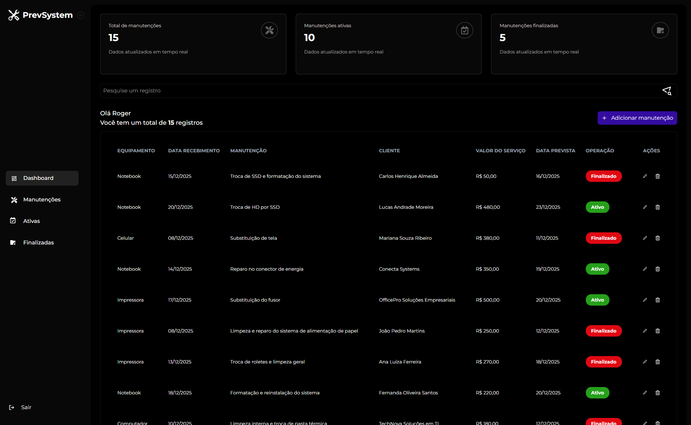
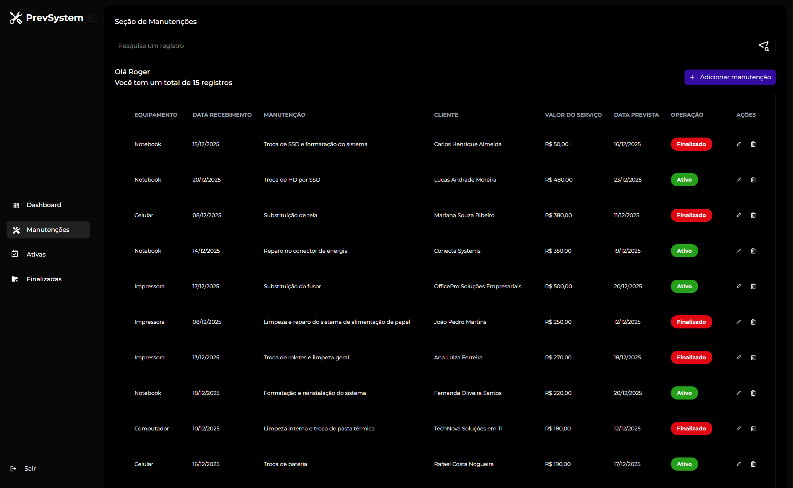
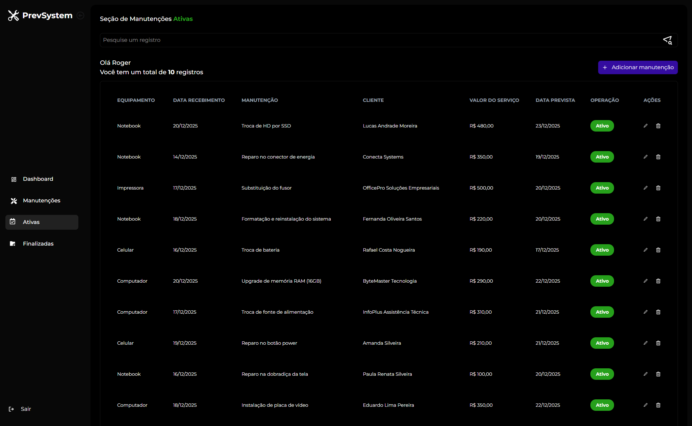
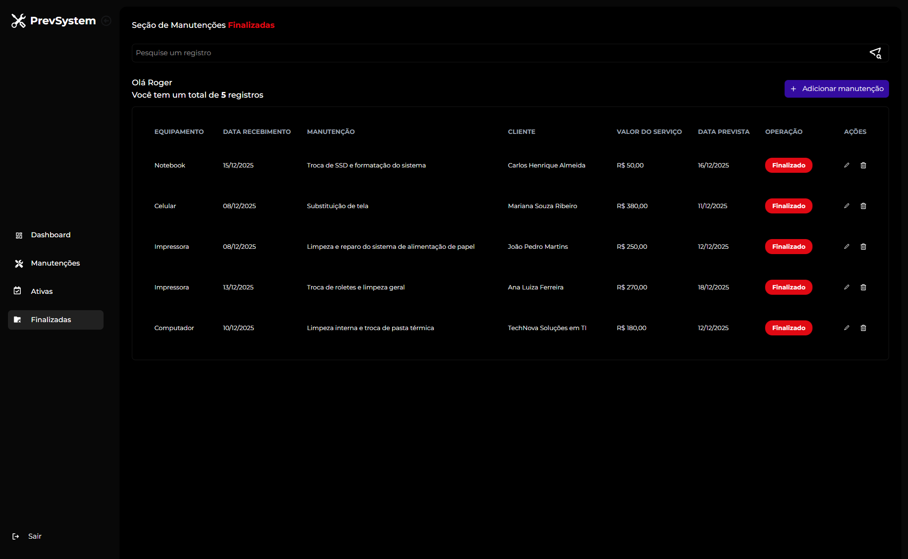

# 🛠️ PrevSystem – Controle de Manutenções Técnicas


Sistema web para **gerenciamento e controle de manutenções técnicas**, permitindo que microempreendedores e profissionais acompanhem serviços, prazos, valores e status de manutenções de forma simples, organizada e eficiente.

---

## 🚀 Visão Geral

O **PrevSystem** foi desenvolvido para facilitar a rotina de profissionais que prestam serviços de manutenção técnica para empresas ou pessoas físicas.

A plataforma permite o **registro completo de manutenções**, controle de **serviços ativos e finalizados**, visualização de **prazos**, **valores**, **clientes** e um **dashboard inteligente** com resumo geral das informações.

O sistema conta com **autenticação de usuários**, **área administrativa**, **filtros de pesquisa**, **status de manutenção** e uma **landing page institucional** apresentando o funcionamento do produto.

---

## 🖼️ Demonstração

### Login


### Cadastro (Signup)


### Dashboard


### Cadastro de Manutenção


### Manutenções Ativas


### Manutenções Finalizadas


---

## 🧩 Funcionalidades

### 🔐 Autenticação

- Criação de conta (signup)
- Login seguro
- Logout disponível pelo menu lateral

---

### 🏠 Dashboard

Após o login, o usuário tem acesso a um **dashboard** com um resumo geral do sistema, incluindo:

- Total de manutenções
- Manutenções ativas
- Manutenções finalizadas
- Cards informativos

---

### ➕ Cadastro de Manutenções

- Cadastro via formulário
- Campos disponíveis:
  - Equipamento
  - Cliente
  - Tipo de manutenção
  - Data de recebimento
  - Data prevista
  - Valor do serviço
  - Observações

---

### 🗂️ Gerenciamento de Manutenções

- Listagem de todas as manutenções cadastradas
- Ações disponíveis:
  - Editar registros
  - Finalizar manutenção
  - Excluir registros
  - Pesquisar por:
    - Equipamento
    - Data de recebimento
    - Manutenções
    - Cliente
    - Valor do serviço
    - Data prevista
    - Operação/Status
    - Observações

---

### ⏱️ Controle de Status

O sistema organiza automaticamente os registros de manutenções por status:

- 🟢 Ativo
- 🔴 Finalizado

Facilitando o acompanhamento dos serviços em andamento e concluídos.

---

### 📊 Seções Dinâmicas

A navegação é feita por meio de um **menu lateral**, permitindo acesso rápido às seções:

- **Dashboard** → Visão geral
- **Manutenções** → Todos os registros
- **Ativas** → Apenas manutenções em andamento
- **Finalizadas** → Histórico de manutenções concluídas

Em todas as seções, o usuário pode:

- Editar registros
- Finalizar manutenções
- Excluir registros
- Pesquisar informações

---

### 🌐 Landing Page

- Página institucional apresentando o sistema
- Explicação clara do funcionamento da plataforma
- Botões de redirecionamento para **Login** e **Cadastro**

---

## 🛠️ Tecnologias Utilizadas

Este projeto foi desenvolvido utilizando tecnologias modernas:

- **Frontend:** React.js
- **Linguagem:** TypeScript
- **Estilização:** Tailwind CSS
- **Backend / Serviços:** Firebase
  - Firebase Authentication
  - Firestore Database

---

## 📁 Estrutura do Projeto

```
prevsystem-app/
├── src/
│ ├── assets/ # Arquivos estáticos
│ ├── components/ # Componentes reutilizáveis
│ ├── contexts/ # Context API (autenticação e estados globais)
│ ├── layout/ # Layouts da aplicação
│ ├── pages/ # Páginas principais
│ │ ├── Admin
│ │ │   ├── Active
│ │ │   ├── Dashboard
│ │ │   ├── Finished
│ │ │   └── Maintenance
│ │ ├── Home
│ │ ├── Login
│ │ ├── Signup
│ │ └── NotFound
│ ├── services/ # Integrações com Firebase
│ ├── App.tsx
│ ├── main.tsx
│ └── index.css
├── .env
├── package.json
├── vite.config.ts
└── README.md

```
---

## ▶️ Como Executar o Projeto

### 📋 Pré-requisitos

- Node.js (versão 18 ou superior)
- NPM ou Yarn

---

### 🔧 Configuração do Ambiente

Este projeto utiliza o **Firebase**, portanto é necessário configurar as variáveis de ambiente.

Crie um arquivo **`.env`** na raiz do projeto e adicione:

```env
VITE_FIREBASE_API_KEY=
VITE_FIREBASE_AUTH_DOMAIN=
VITE_FIREBASE_PROJECT_ID=
VITE_FIREBASE_STORAGE_BUCKET=
VITE_FIREBASE_MESSAGING_SENDER_ID=
VITE_FIREBASE_APP_ID=
```
> ⚠️ As credenciais podem ser obtidas no console do Firebase ao criar um novo projeto.

---

### ▶️ Executando a aplicação

```bash
# Clone o repositório
git clone https://github.com/rogeranacleto/prevsystem-app.git

# Acesse a pasta do projeto
cd prevsystem-app

# Instale as dependências
npm install

# Inicie a aplicação
npm run dev
```

---

## 🎯 Objetivo do Projeto

O **PrevSystem** foi desenvolvido para oferecer uma solução prática e acessível para o controle de manutenções técnicas, sendo ideal para microempreendedores, técnicos autônomos e pequenos negócios.

Além do aspecto funcional, o projeto tem como objetivo consolidar conhecimentos em React, TypeScript, Tailwind CSS e Firebase, em um cenário real de aplicação em produção.